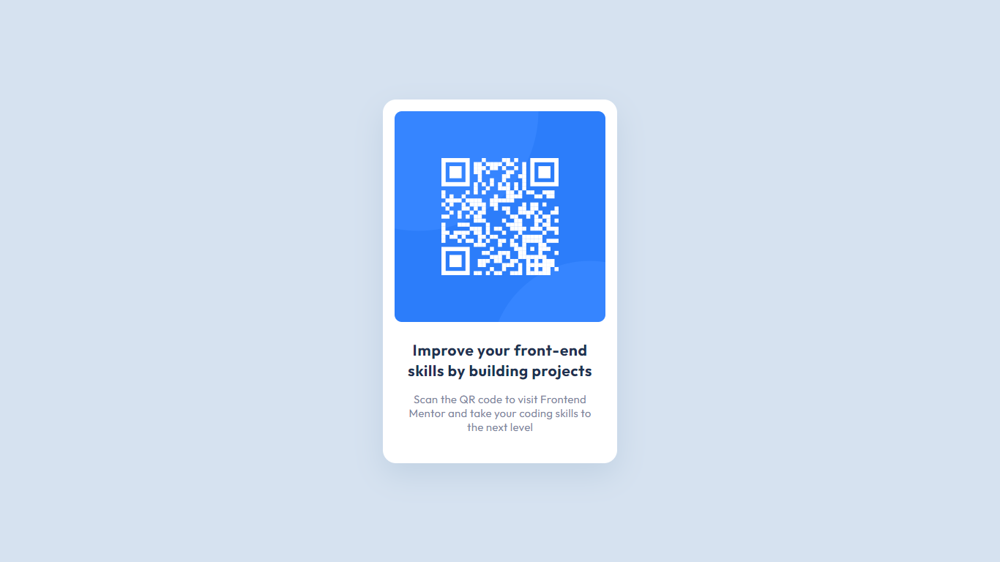

# Frontend Mentor - QR code component solution

This is a solution to the [QR code component challenge on Frontend Mentor](https://www.frontendmentor.io/challenges/qr-code-component-iux_sIO_H). Frontend Mentor challenges help you improve your coding skills by building realistic projects. 

## Table of contents

- [Overview](#overview)
  - [Screenshot](#screenshot)
  - [Links](#links)
- [My process](#my-process)
  - [Built with](#built-with)
  - [What I learned](#what-i-learned)
  - [Continued development](#continued-development)
  - [Useful resources](#useful-resources)
- [Author](#author)
- [Acknowledgments](#acknowledgments)

## Overview

This is my first Frontend Mentor challenge. I followed a Web Development course before and learned CSS but I didn't practice or tried making something myself. After the course when I tried making a website for a hackathon I realized I just learned it passively and jumped on next topics like Javascript without actually practicing it. I faced imposter syndrome and tutorial hell. Now I am learning web dev again and learning by doing. Making progress slowly and trying to learn concepts deeply instead of completely as tasks. It was fun to complete the challenge on my own trying to figure out why things are not working, and how to fix them. Web design may not be considered art but it is like an art. It was similar to painting for me I was an artist(programmer) looking at a scenery(design) and trying to replicate it on my artboard(web browser) with my tools(keyboard) and properties(CSS properties). This analogy may sound lame but it made me love CSS more.
 
### Screenshot

Add a screenshot of your solution. The easiest way to do this is to use Firefox to view your project, right-click the page and select "Take a Screenshot". You can choose either a full-height screenshot or a cropped one based on how long the page is. If it's very long, it might be best to crop it.

Alternatively, you can use a tool like [FireShot](https://getfireshot.com/) to take the screenshot. FireShot has a free option, so you don't need to purchase it. 

Then crop/optimize/edit your image however you like, add it to your project, and update the file path in the image above.

**Note: Delete this note and the paragraphs above when you add your screenshot. If you prefer not to add a screenshot, feel free to remove this entire section.**

### Links

- Solution URL: [You can see my solution here](https://your-solution-url.comhttps://www.frontendmentor.io/solutions/qr-code-component-using-css-flexbox-and-html5-rk3LIdsmc)
- Live Site URL: [https://ritesh-karankal.github.io/qr-code-component/](https://ritesh-karankal.github.io/qr-code-component/)

## My process

- I first traced the design images in figma to get better understanding of margin, padding, and font properties used.
- Then I initialized a git repository to track changes.
- Structured the content with HTML5.
- Made card using flexbox.
- Used text properties, margin and padding to match the design with the help of inspect tab in Figma.
- Used CSS reset to make it pixel perfect and adjust defaults.
- Deployed it using github pages.
- Made some changes, pushed it to github and repeated it many times.
- Followed and learned best accessibility best practices.
- Asked some doubts and shared my solution on socials.

### Built with

- Semantic HTML5 markup
- CSS custom properties
- Flexbox
<!-- - CSS Grid
- Mobile-first workflow
- [React](https://reactjs.org/) - JS library
- [Next.js](https://nextjs.org/) - React framework
- [Styled Components](https://styled-components.com/) - For styles -->

**Note: These are just examples. Delete this note and replace the list above with your own choices**

### What I learned

- I have learnt css before but I didnt practiced it when I came to make a website on my own I struggled to align items.
But I am now comfortable using flexbox.
- Practiced tracing design in Figma.
- How to center a div using flex-box.
- Made a card component.
- Deploying using github pages.
- Made a pixel perfect design.
- Got little clarity for max-height and min-height.
- Got to know about some CSS reset.

### Continued development

Use this section to outline areas that you want to continue focusing on in future projects. These could be concepts you're still not completely comfortable with or techniques you found useful that you want to refine and perfect.

I am still confused about some elements what to use like padding or margin.
Should I adjust text width with padding or width property.
How to use apt tags for texts.
What are the best pratices for units.

**Note: Delete this note and the content within this section and replace with your own plans for continued development.**

### Useful resources

- [Example resource 1](https://www.example.com) - This helped me for XYZ reason. I really liked this pattern and will use it going forward.
- [Example resource 2](https://www.example.com) - This is an amazing article which helped me finally understand XYZ. I'd recommend it to anyone still learning this concept.

**Note: Delete this note and replace the list above with resources that helped you during the challenge. These could come in handy for anyone viewing your solution or for yourself when you look back on this project in the future.**

## Author

- Github - [ritesh-karankal](https://github.com/ritesh-karankal)
- Frontend Mentor - [@ritesh-karankal](https://www.frontendmentor.io/profile/ritesh-karankal)
- Twitter - [@riteshk_twt](https://twitter.com/riteshk_twt)

**Note: Delete this note and add/remove/edit lines above based on what links you'd like to share.**

## Acknowledgments

This is where you can give a hat tip to anyone who helped you out on this project. Perhaps you worked in a team or got some inspiration from someone else's solution. This is the perfect place to give them some credit.

I wanna give credit to 
I was struggling to make it pixel perfect. I was not able to figure out where the extra padding between elements were coming from.
**Note: Delete this note and edit this section's content as necessary. If you completed this challenge by yourself, feel free to delete this section entirely.**
